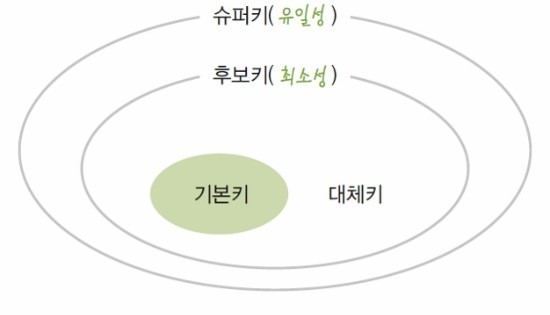
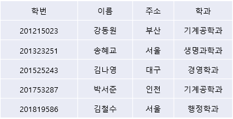
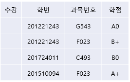
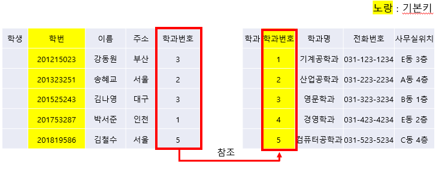
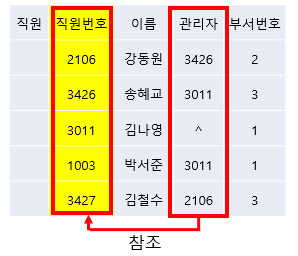
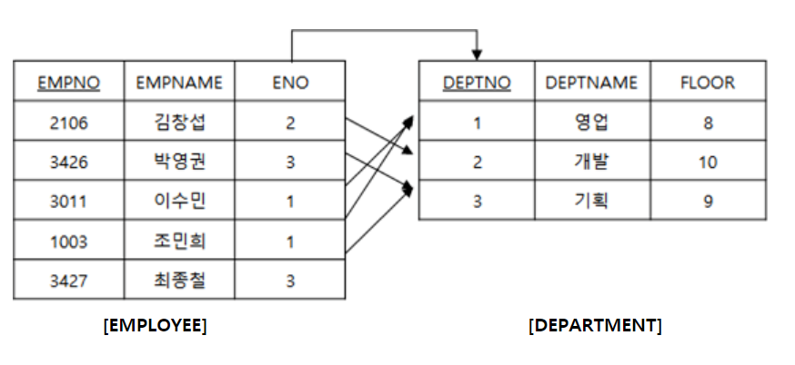
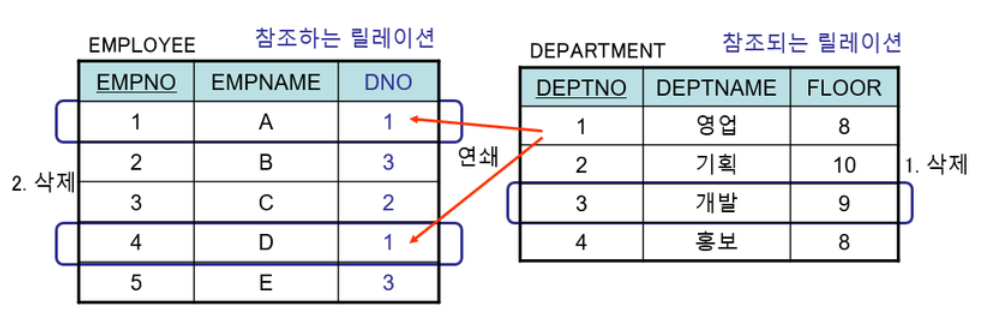
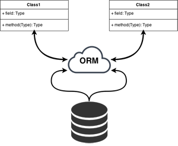

## 도메인 (Domain)

하나의 속성(Attribute)에 나타낼 수 있는 같은 타입의 원자값들의 집합

**성별** 속성의 도메인: 남, 여

**나이** 속성의 도메인: 양의 정수 (1,2,...)

- 실제 속성 값을 나타낼 때, 그 값의 합법/허용 여부를 시스템이 검사할 때에도 이용한다.

- 각 속성의 도메인의 값들은 **원자값**이다.

- 동일한 도메인이 여러 속성에서 사용될 수 있다.

  예) 양의 정수는 나이, 물품 개수 등 다양한 속성의 도메인이 될 수 있음.

## Key의 종류

### Key

tuple의 유일성을 보장하기 위한 하나 이상의 속성(Attribute)들의 모임

### Relation Key

각 tuple을 고유하게 식별(유일성)할 수 있는 하나 이상의 **속성들의 모임**

- relation이 튜플들의 집합이기 때문에 모든 속성을 모아 사용하면 식별 가능하지만, 적은 개수의 속성으로 이루어진 키(최소성)를 원한다.

  

  **유일성** : 하나의 키 값으로 하나의 튜플만을 **유일**하게 식별하는 성격

  **최소성**: 유일성을 만족할 때에 반드시 필요한 속성만으로 구성되는 성격

  

  **key가 최소성을 만족해야 하는 이유**

  - 여러 relation에서 속성 값들이 중복되는 것을 방지하기 위해

  - relation의 튜플들을 접근하는 속도를 높이기 위해서 키에 **인덱스**를 만드는데, Key가 작을수록 인덱스의 크기도 줄고, 검색시간도 단축된다.

    

- 키의 종류 : Super Key, Candidate Key, Primary Key, Alternate Key, Foreign Key

  

  

#### Super Key (슈퍼키)

Relation 내에 있는 속성들의 집합으로 구성된 **최소성을 만족하지 않는 Key**

- 각 tuple을 유일하게 식별하기 위해 사용한다.

- 모든 tuple에 유일성은 만족하지만, 최소성을 만족하지 않는다.

  

#### Candidate Key (후보키)

유일성과 최소성을 모두 만족하는 모든 key

현재는 중복이 없더라도 미래에 중복성이 일어날 가능성도 고려해서 후보키로 지정해야 한다.

- 예시

  [이름] 은 후보키가 될 것 같지만 동명이인 때문에 후보키가 될 수 없다.

  [이메일]은 미래에도 고유하기 때문에 후보키가 될 수 있다.

- - Super key: [학번] [이름, 학번] [이름, 주소]  [학과, 학번]  [이름, 주소, 학과] ...
  - [이름, 학번] 에서 이름 속성이 없어도 tuple들을 식별할 수 있다. ⇒ 후보키X
  - [이름, 주소] 는 주소가 없으면 유일성을 만족하지 않는다. ⇒ 후보키

- 

  - [학번, 과목번호] 만 후보키다.

  - [학번]이나 [과목번호]는 후보키가 될 수 없다.

    

#### Primary Key (기본키)

후보키 중에 선택된 key

- NULL값을 가질 수 없고, 중복되면 안된다.

- 속성 값이 변경될 가능성이 높은 속성은 기본키로 선정하지 않는 것이 좋다.

- 복합키를 피한다.

- 가능하면 작은 정수값, 짧은 문자열을 가지는 속성으로 정한다.

  - 복합키 (Composite Key)

    2개 이상의 속성으로 구성된 키

    

#### Alternate Key (대체키)

2개 이상의 후보키가 있을 때, 기본키를 제외한 나머지 후보키

- 예시

  고객정보 table에서

  [신용카드 번호] - 기본키

  [주민등록번호] - 대체키

  

#### Foreign Key (외래키)

어떤 relation의 기본키를 참조하는 키속성

- 서로 관계가 있는 table들 사이에서 데이터의 일관성을 보장해주는 수단
- 한 relation의 키가 다른 relation의 튜플들을 유일하게 식별할 수 있는 키
- 참조되는 relation의 기본키와 같은 도메인을 가져야 한다.

- 자체 relation을 참조하는 외래키 예시

  

# 무결성 제약 조건

데이터베이스 갱신으로 데이터의 일관성이 깨지 않도록(데이터가 무결하도록) 보장하는 규칙

- 데이터가 무결하다: 데이터가 입력/수정/삭제/연산해도 데이터의 **정확도**와 **유효성**이 유지된다.

#### 데이터베이스의 일관성을 깨는 경우

- 데이터를 조회했지만 없을 때

- 쿼리문 처리 과정에서 관계없는 속성끼리 비교할 때

- 참조된 relation에서의 데이터가 함께 삭제되지 않았을 때

  

## 무결성 제약조건의 장점

스키마를 정의할 때 일관성 조건을 **단 한 번만** 명시하고, 데이터베이스가 갱신될 때 DBMS가 자동으로 일관성 조건을 검사하기 때문에 응용 프로그램에서 데이터 유효성/일관성 조건을 검사할 필요가 없다.

- 예시

  통장 잔고 ≥ 0 이라는 무결성 제약조건을 정의하면, 개발자는 잔고가 0보다 작은 경우를 검사하는 코드를 작성하지 않아도 된다.

  

## 무결성 제약조건의 단점

무결성 제약조건들 간에 서로 충돌이 발생할 수 있다.

응용 프로그램의 논리로 무결성 제약조건을 유지할 때보다 에러 발생 가능성이 낮아진다.

## 데이터베이스 보안 VS 데이터베이스 무결성

- 데이터베이스 보안

  권한 없는 사용자가 DB에 접근해서 검색/갱신하지 못하도록 DB를 보호

- 데이터베이스 무결성

  권한을 가진 사용자에게서 DB의 정확성을 지키는 것

  

## 무결성 제약조건 종류

### 도메인 제약조건 (Domain contraint)

각 속성의 값은 반드시 도메인에 속하는 원자값이어야 한다.

- 속성에 저장되는 값들의 범위를 제한

- 데이터 형식으로 값들의 유형을 제한

  예) 고등학교 학년은 [1,2,3] 중 하나여야 한다.

- 속성의 default value를 지정

  

### 개체 무결성 제약조건 (Entity integrity constraint)

기본키에 해당하는 속성값은 NULL값을 가질 수 없다.

기본키는 중복값을 가질 수 없다.

- 기본키의 속성들이 NULL값을 가지면 tuple을 고유하게 식별할 수 없기 때문에, 기본키를 구성하는 속성의 값은 NULL값을 가질 수 없다.

  

### 키 제약조건 (Key constraint)

하나의 relation에는 최소 하나의 키가 존재해야 한다.

### 참조 무결성 제약조건 (Referential integrity constraint)

외래키의 값은 NULL이거나 참조하는 relation의 기본키 값 중 하나여야 한다.

(외래키의 값은 참조할 수 없는 값을 가질 수 없다)

- 참조하는 relation에 참조할 수 없는 값을 외래키 값으로 가질 수 없다.
- 참조 무결성은 두 릴레이션에 연관된 튜플들 사이에서 일관성을 유지하는데에 사용된다.

**조건 (둘 중 하나만 만족하면 된다)**

R2가 R1의 기본키를 참조할 때

1. 외래키의 값은 R1의 어떤 튜플의 기본키 값과 같다.
2. 외래키가 자신을 포함하고 있는 relation의 기본키를 구성하지 않으면 NULL값을 가진다.

- 신입사원을 채용하고 아직 부서에 발령내지 않았지만 이 신입사원의 정보를 EMPLOYEE relation에 삽입하기 위해서는 신입사원의 부서번호(ENO)에 임시로 NULL값을 지정할 수 있다.

- 만약 DBMS가 참조 무결성 제약조건을 제공하지 않으면 해당 신입사원 tuple을 EMPLOYEE relation에 삽입했을 때 존재하지 않는 부서에 근무하는 경우가 발생하게 된다.

  

### NULL 무결성

특정 속성의 값은 NULL을 가질 수 없다.

### 고유 무결성

특정 속성에 삽입되는 데이터는 고유한 값을 가져야 한다.

## 참조 무결성 제약조건을 만족하기 위해 DBMS에서 제공하는 옵션

- restricted (제한)

  제약조건 위배를 일으키는 연산 거절

- cascade (연쇄)

  참조되는 relation에서 튜플을 삭제하면

  ⇒ 참조하는 relation에서 이 튜플을 참조하는 튜플들도 함께 삭제

  

  - default 값

    참조되는 relation에서 튜플을 삭제하고 참조하는 relation에서 이 튜플을 참고하는 튜플들의 외래키에 default값을 넣는다

# ORM

## DB의 영속성 (Persistence)

데이터를 생성한 프로그램이 종료되더라도 생성한 데이터가 사라지지 않는 특성을 말한다.

⇒ 영속성을 갖지 않는 데이터는 메모리에만 존재하기 때문에 프로그램을 종료하면 모두 삭제된다.

### Object Persistence (객체의 영속성)

- 메모리 상의 데이터를 파일 시스템, RDB, 객체 데이터베이스 등을 활용하여 영구적으로 저장하면 데이터에 영속성이 부여된다.

- **데이터를 DB에 영구적으로 저장하는 방법**

  1. JDBC (java에서 사용)
  2. Spring JDBC
  3. **Persistence Framework** (Hibernate, Mybatis...)
     - JDBC 프로그래밍의 복잡함이나 번거로움을 줄이고, 간단한 작업으로 DB와 연동되는 시스템을 개발할 수 있다.
     - SQL Mapper와 **ORM**으로 나뉜다.

  

# ORM 이란?

- Object-relational mapping

- OPP의 객체와 RDBMS의 테이블을 **자동**으로 매핑하는 것을 말한다.

- **ORM의 목적**

  RDBMS의 제약을 최대한 받지 않으면서 관계형 DB를 객체로 쉽게 표현하고 사용하자!

- 클래스와 테이블은 서로 호환되지 않는데, ORM을 통해서 객체 간의 관계를 바탕으로 SQL문을 자동으로 생성하여 DB를 조회하고 조작할 수 있다.

- 클래스 ↔ 스키마

- 메서드 ↔ 쿼리

- 객체 ↔ 테이블

  

## ORM 의 장점

- **완벽한 객체지향적인 코드 작성**

  - ORM을 이용하면 클래스의 메서드로 데이터베이스를 조작할 수 있어, 개발자가 객체 모델과 관계만을 고려해 프로그래밍 할 수 있도록 도와준다.

    ⇒ 기존의 SQL의 절차/순차적인 접근 방식이 아닌, 객체지향적인 접근으로 생산성을 높여준다.

  - 쿼리문을 사용하면서 필요한 선언문, 할당, 종료와 같은 부수적인 코드가 없거나 양이 줄어들어, CRUD를 위한 긴 쿼리문을 작성하는 부담을 덜 수 있다.

  - 각 객체(Model)별로 코드를 작성하여 가독성을 높인다.

- **재사용, 유지보수, 리팩토링 용이**

  - 매핑하는 정보가 명확해서 ERD를 보는 것에 대한 의존도를 낮출 수 있다.

  - ORM은 독립적으로 작성되며, 객체로 작성되기 때문에 재사용할 수 있다.

    ⇒ 모델에서 가공한 데이터를 컨트롤러에 의해 뷰와 합쳐지는 형태로 구현되어, 디자인 패턴을 견고하게 다지는 데에 유리하다.

- **RDBMS의 종속성 감소**

  - 객체 간의 관계를 바탕으로 쿼리문을 자동으로 생성하기 때문에 RDBMS와 객체지향 모델 사이의 간극을 좁힐 수 있다.

  - 대부분의 ORM 솔루션은 DB에 종속적이지 않는다.

    & 개발자는 객체에만 집중할 수 있다.

    ⇒ 극단적인 예로 DBMS를 교체해야 하는 거대한 작업에서도 비교적 적은 리스크와 시간이 소요된다.

  - 자바에서 가공할 경우 equals, hashCode의 오버라이드 같은 자바의 기능을 이용할 수 있고, 간결하고 빠르게 가공이 가능하다.

## ORM의 단점

- **ORM만으로 서비스를 구현할 수는 없다.**

  - 사용하기는 편하지만 설계를 신중하게 해야 한다.

  - 프로젝트의 복잡성이 커지면 ORM을 설계하기 어렵다.

  - 설계가 미흡하여 잘못 구현했을 때 속도 저하, 심각할 경우 일관성이 무너지는 문제점이 생길 수 있다.

  - 일부 자주 사용되는 대형 쿼리문은 속도를 위해 별도의 튜닝이 필요할 수 있다.

  - DBMS의 고유한 기능을 사용하기 어렵다.

- 프로시저가 많은 시스템에서는 ORM의 객체지향적인 장점을 활용하기 어렵다.

  - 이미 프로시저가 많은 시스템에서는 객체로 변경해야 하고, 그 과정에서 생산성이 저하되고 리스크가 발생할 수 있다.

    

## 객체-관계 간의 불일치

세분성, 상속성, 일치, 연관성, 탐색에서 객체-관계 간의 불일치가 발생한다.

- 세분성 (Granularity)

  경우에 따라 데이터베이스에 존재하는 테이블 수보다 더 많은 객체를 가진 모델이 생길 수 있다.

- 상속성 (Inheritance)

  RDBMS는 객체지향 프로그래밍의 특징인 상속 개념이 없다.

- 일치 (Identity)

  RDBMS에서는 기본키(primary key)를 이용하여 Identity를 정의하지만, 자바는 객체 식별`a==b`와 객체 동일성 `a.equals(b)`를 모두 정의한다.

- 연관성 (Associations)

  객체지향 언어는 방향성이 있는 **참조**를 사용해 연관성을 나타내지만, RDBMS는 방향성이 없는 **외래키**를 이용해서 나타낸다.

- 탐색 (Navigation)

  자바와 RDBMS에서 객체를 접근하는 방식이 근본적으로 다르다.

  자바는 계층적 형태로 하나의 연결에서 다른 연결로 이동하며 탐색하지만,

  RDBMS에서는 JOIN을 통해서 여러 entity를 접근하고 원하는 entity를 선택하는 방식으로 탐색한다.

## 개발언어 별 ORM Framework

| 개발 언어 | Framemwork                                 |
| :-------- | :----------------------------------------- |
| Java      | Hibernate ORM                              |
| C#        | Entity Framework Core                      |
| PHP       | Eloquent ORM, Laravel 설치에 포함되어있다. |
| Node.js   | Sequelize ORM                              |
| Python    | Django                                     |
| Ruby      | Ruby on Rails                              |

