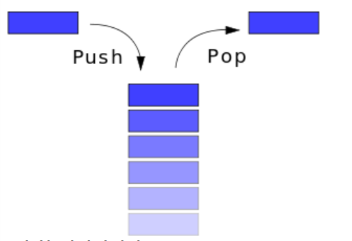
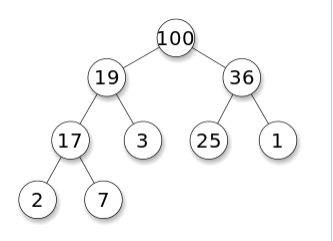
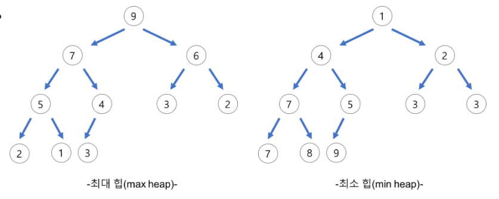
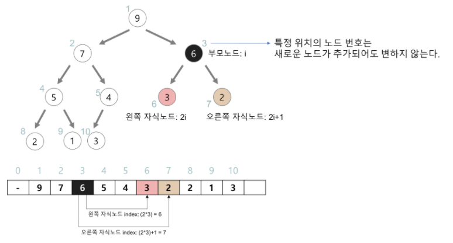
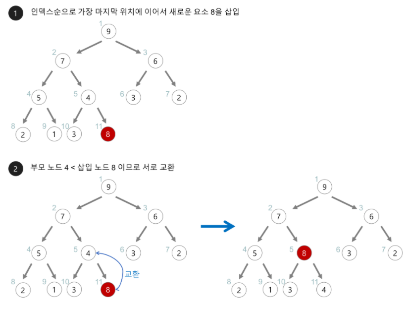
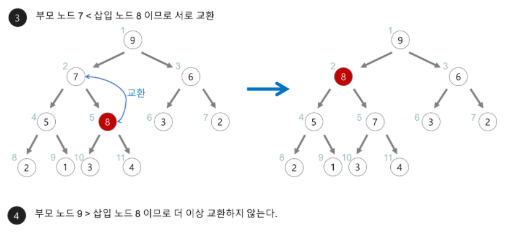
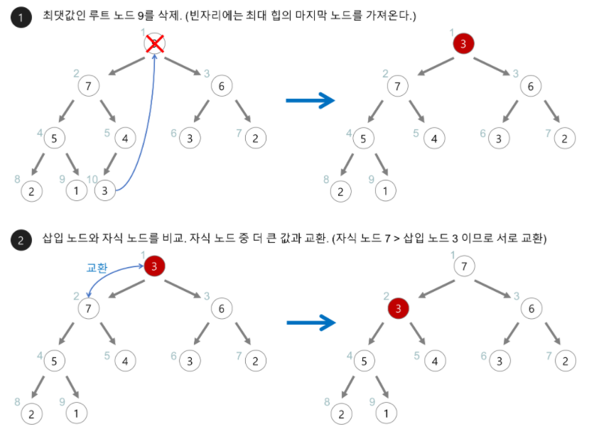
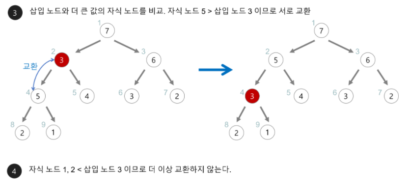

# 스택 (Stack)

LIFO 형식의 자료구조 (Last In First Out)

마지막에 입력한 자료가 가장 먼저 출력된다. (후입선출)



- 스택의 top 포인터

  가장 위의 자료를 가리키는 포인터를 top이라고 한다면, 무조건 top을 활용해서만 데이터를 삽입/삭제가 가능하다.

- 스택 사용법(push, pop, top, empty, size)과 시간 복잡도

  - push

    스택의 삽입 연산. 스택의 가장 마지막에 데이터를 삽입한다.

    시간 복잡도: O(1)

  - pop

    스택에서 가장 마지막 데이터(제일 위에 있는 데이터)를 꺼내면서 삭제한다.

    시간 복잡도: O(1)

  - peek (top)

    제일 위에 있는 데이터를 삭제하지 않고 조회만 한다.

    마지막 데이터와 중복되는 데이터를 삽입하지 않기 위해 확인할 때 사용한다.

    시간 복잡도: O(1)

  - empty

    스택이 비어있는지 검사한다.

    (full: 스택이 다 차있는지 검사)

    시간 복잡도: O(1)

  - size (level)

    스택의 크기를 알려준다. (데이터가 몇 개 들어있는지 조회)

    시간 복잡도: 배열로 구현하면 O(1) 연결리스트로 구현하면 O(n)

- 배열로 만든 스택 VS 연결리스트로 만든 스택

  배열로 만든 스택은 보관할 수 있는 자료의 개수가 유한하지만, 연결리스트로 만든 스택은 크기가 무한하다.

  배열로 만든 스택이 구현하기 쉽고 메모리도 보다 적게 차지한다.

- 스택이 중요한 이유

  컴퓨터에서는 한 번 참조된 곳이 또 참조될 확률이 높다. (이를 **참조지역성** 이라고 한다.)

  그 중에서도 최근에 참조된 자료가 다시 참조될 확률이 높다. 이에 활용할 수 있는 자료구조가 스택이다.

## 스택 사용 사례

- 재귀함수

  재귀함수를 호출해야 할 때 임시 데이터를 스택에 저장하면 좋다.

- 웹 브라우저의 방문 기록 ( 뒤로가기)

- 실행 취소 (undo)

- 역순 문자열을 만들 때

- 수식에서

  올바른 괄호 문자열 검사할 때

  후위 표기식 계산할 때

- 프린터 출력 대기

- 은행 상담 대기


------


# 힙이란?



최대힙 예시

- 여러 개의 값 중 최대/최소값을 빠르게 찾기 위해 사용하는 완전이진트리를 기본으로 한 자료구조
- A가 B의 부모노드일 때, A의 key값과 B의 key값 사이에 대소관계가 성립한다.
- 본래 이진탐색트리에서는 중복값을 허용하지 않지만, 힙 트리에서는 중복값을 허용한다.
- 시간복잡도 : O(log n)
- 우선순위 큐를 구현할 때 사용한다.
- 우선순위 큐란?


## 최대힙(max heap)과 최소힙(min heap)



- 최대힙

  부모노드의 key ≥ 자식노드의 key

- 최소힙

  부모노드의 key ≤ 자식노드의 key


## 힙의 구현


### 힙을 배열로 구현할 때 부모노드와 자식노드의 관계



- 왼쪽 자식의 인덱스 = 부모인덱스 *2
- 오른쪽 자식의 인덱스 = 부모인덱스*2 +1
- 부모의 인덱스 = 자식인덱스 // 2
- 구현을 용이하게 하기 위해 루트노드를 1로 잡고 0번은 비워놓는다.
- 새로운 노드가 추가되어도 루트노드의 오른쪽 자식노드의 번호는 언제나 3번이다.
- C언어로 힙 구현


### 힙의 삽입연산





1. 새로운 값이 삽입되면 우선 힙의 마지막 노드에 삽입한다.
2. 새로운 노드를 부모노드와 대소관계를 비교하면서 부모노드와 교환하며 이동한다.

- C언어로 최대힙 삽입 구현

  ```c
  // 최대 힙(max heap) 삽입 함수
  void insert_max_heap(HeapType *h, element item){
    int i;
    i = ++(h->heap_size); // 힙 크기+1
  
    /* 트리를 거슬러 올라가면서 부모 노드와 비교하는 과정 */
    // i가 루트 노트(index: 1)이 아니고, 삽입할 item의 값이 i의 부모 노드(index: i/2)보다 크면
    while((i != 1) && (item.key > h->heap[i/2].key)){
      // i번째 노드와 부모 노드를 교환
      h->heap[i] = h->heap[i/2];
      i /= 2;
    }
    h->heap[i] = item; // 새로운 노드 삽입
  }
  ```


### 힙의 삭제연산

힙에서 삭제연산을 할 때, 우선순위를 고려한 루트노드(최우선순위)가 삭제된다.

아래 예시는 최대힙에서 삭제를 진행하는 과정이다.





1. 최대힙에서 삭제할 때, 최대값인 루트노드가 삭제된다.
2. 삭제된 루트노드는 힙의 마지막 노드로 대체하고 마지막 노드를 제거한다.
3. 변경된 루트노드부터 자식노드와 대소관계를 비교하면서 힙을 재정렬한다.

- C언어로 최대힙 삭제 구현

  ```c
  // 최대 힙(max heap) 삭제 함수
  element delete_max_heap(HeapType *h){
    int parent, child;
    element item, temp;
  
    item = h->heap[1]; // 루트노드 값을 반환하기 위해 item에 할당
    temp = h->heap[(h->heap_size)--]; // 마지막 노드를 temp에 할당하고 힙 크기-1
    parent = 1;
    child = 2;
  
    while(child <= h->heap_size){
      // 현재노드의 자식노드 중 더 큰 자식노드를 찾는다. 
      if( (child < h->heap_size) && ((h->heap[child].key) < h->heap[child+1].key) ){
        child++;
      }
      // (더 큰 자식노드) <= 마지막노드 => break
      if( temp.key >= h->heap[child].key ){
        break;
      }
  
      // (더 큰 자식노드) > 마지막노드 => 부모 노드와 (더 큰 자식노드)를 교환
      h->heap[parent] = h->heap[child];
      // 다음 레벨로 이동
      parent = child;
      child *= 2;
    }
  
    // 마지막노드를 재정렬한 위치에 삽입
    h->heap[parent] = temp;
    // 최댓값(루트노드)을 반환
    return item;
  }
  ```