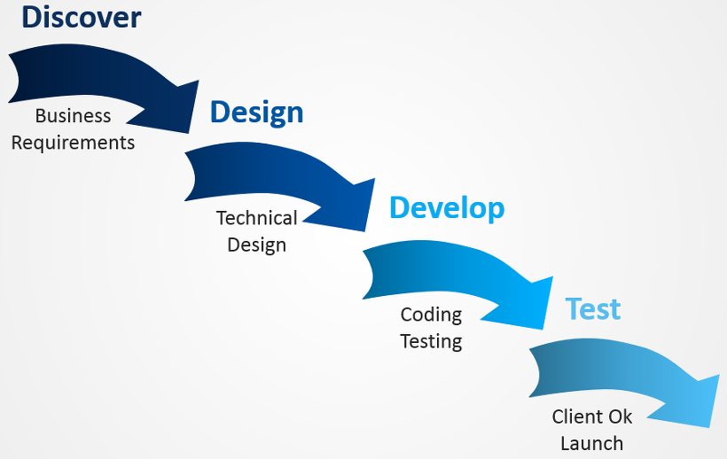
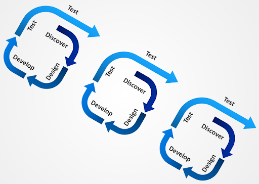
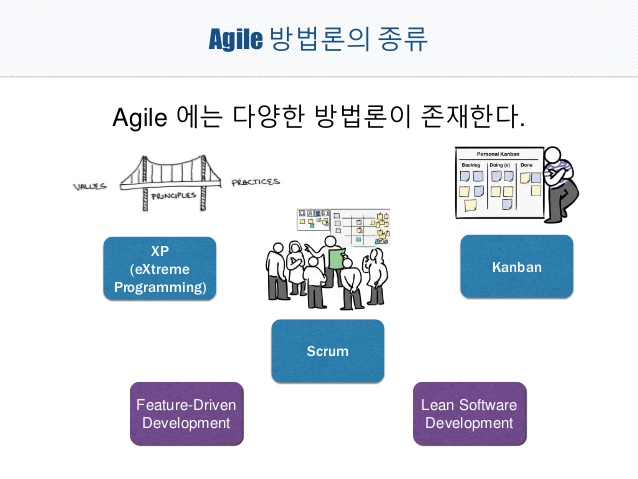
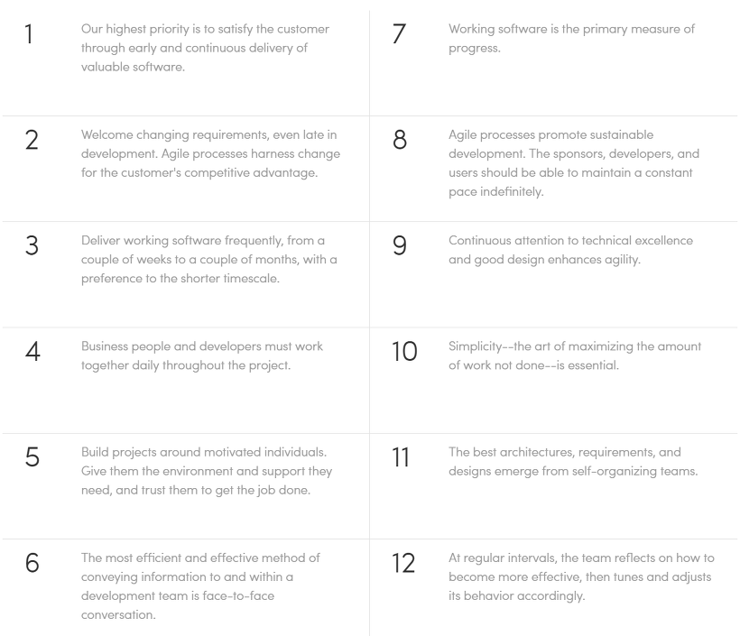
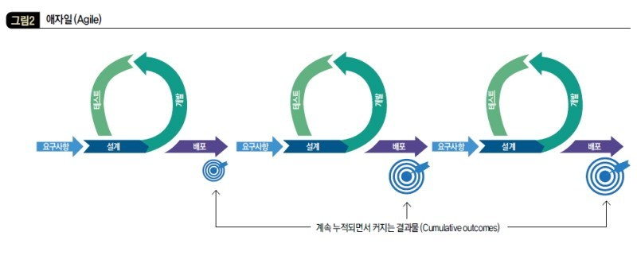
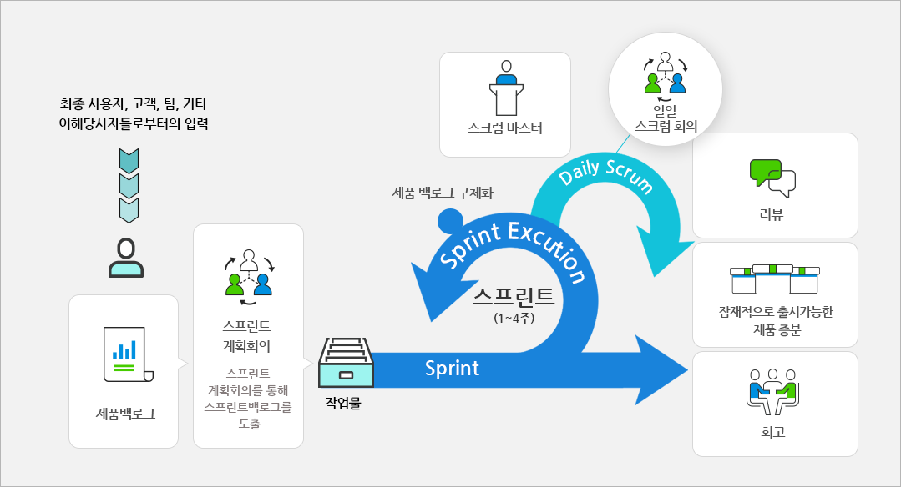
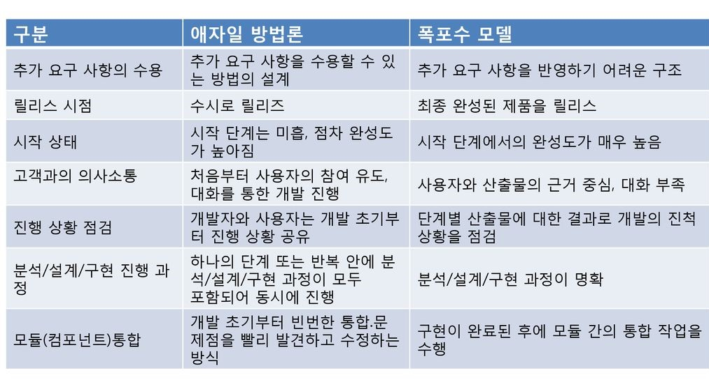

# 프로젝트 관리

### 프로젝트 관리는 왜 필요할까?

- 프로젝트 과업 범위를 명확하게 정의하고 정해진 일정 내에 가용한 자원을 효율적으로 활용하여 목표를 달성하기 위해
- 점점 복잡해지고 많은 이슈를 내재하고 있는 프로젝트의 성공적인 수행을 위해 체계적인 프로젝트 관리가 필수!
- 프로젝트 팀원 간의 협업, 이해관계자 간의 효과적인 의사소통 수행이 중요하다.
- 프로젝트 **초기**에 체계적인 계획 수립과 진행과정에서의 철저한 수행 통제가 필수!

### 프로젝트 관리 영역

| 구분                     | 관리 영역       | 정의                                                         |
| ------------------------ | --------------- | ------------------------------------------------------------ |
| Core Area (목표)         | 범위 관리       | 요구사항을 기반으로 과업의 범위를 정의하고 실행과정에서 범위 변경을 통제 |
|                          | 일정 관리       | 일정 계획을 수립하고 납기 준수를 위해 일정을 통제            |
|                          | 원가 관리       | 승인된 프로젝트를 예산 내에서 완료하도록 원가를 통제         |
|                          | 품질 관리       | 프로젝트 품질 요구사항을 달성하기 위해 계획 수립, 통제 수행  |
| Facilitating Area (수단) | 자원 관리       | 조직 및 팀원을 구성하고 자원을 효과적으로 활용 및 관리       |
|                          | 의사소통 관리   | 의사소통 정보를 적절하게 생성, 취합, 배포, 관리              |
|                          | 위험 관리       | 발생가능한 위험을 식별하고 체계적으로 분석, 대응, 통제       |
|                          | 조달 관리       | 조달을 계획하고 조달업체의 성과를 관리 및 통제               |
|                          | 이해관계자 관리 | 식별된 이해관계자의 기대사항과 그들이 제기하는 이슈를 관리   |

### 프로젝트 관리의 핵심 3요소

- 과업 범위 (Scope)
- 예산 (Cost)
- 일정 (Time)

 ⇒  과업 범위, 예산, 일정을 정하고 관리하여 **품질**을 높이는 것이 목표!

# 프로젝트 방법론

### 방법론이란?

- Methodology = Method + Knowledge
- 조직 내 지식을 기반으로 일을 수행하는 **절차, 방법, 원칙** 을 정의한 것
- 관리 방법론과 개발 방법론이 있다.
- 관리 방법론
  - 프로젝트를 관리 (계약, 인력, 외주관리 등)
  - 기대효과 : 프로젝트 수행의 효과성
- 개발 방법론
  - 시스템 개발 업무 (분석, 설계, 개발, 테스트, 설치 등)를 정의
  - 기대효과 : 시스템 개발의 효율성

# Waterfall 모델 VS 애자일 방법론

## Waterfall 모델 (폭포수 모델)

- 초기에 상세 개발 계획을 모두 수립하고 순차적으로 개발을 진행하여 각 단계의 산출물을 중심으로 진행상황을 관리

- 현장의 거의 대부분의 IT 프로젝트에 적용되고 있다.

- **분석 ⇒ 설계 ⇒ 개발 ⇒ 테스트** 순서로 진행

- **분석 단계**에서 고객이 제시한 요구사항이 반영된 결과물을 **테스트 단계**에서 확인 가능

  요구사항 변경은 필연적으로 발생한다.

  ⇒ 프로젝트의 마무리 단계이기 때문에 **요구사항의 추가 및 변경**이 어려움

  ⇒ 프로젝트 일정을 맞추기 어렵다.

- 고객이 산출물을 확인하는 시점이 늦다. (테스트 단계 쯤에 확인 가능)

- 하나의 프로젝트는 기획, 개발, 테스트, 배포 등 다양한 분야의 전문가가 필요한데, 타 영역에 대한 이해와 의사소통이 부족해서 업무 진행에서 어려움이 발생하고 결과물의 완성도를 높이기 어렵다.

## 애자일 방법론

- **일정한 반복주기**를 가지고 끊임없이 프로토타입을 만들어낸다.
- 필요할 때마다(반복주기마다) 요구사항을 추가 및 수정 가능하다.
- 반복주기를 반복하여 점점 더 커다란 소프트웨어를 개발하는 방식
- **고객 지향적** : 각 반복주기마다 고객을 참여시켜 요구사항 변경과 결과 검증을 할 수 있다.

- Agile은 다양한 프레임워크와 방법론을 포함하는 포괄적인 용어다.
- 자주 쓰이는 애자일 방법론 방식 : Scrum, XP, Kanban
- 낭비를 최소화하고 **고객 가치**에 집중하고자 하는 Lean 사상을 가지고 있다.
- 모든 부서가 프로젝트 전체에 참여하여 **협업과 빠른 의사소통**이 가능하다.
- 애자일 사상을 4가지를 강조하는 선언문과 12가지 원칙을 기반으로 한다.

### 애자일 선언문 - 4가지 가치

- Individuals and interactions (개인과 상호작용)
- Working Product (동작하는 제품)
- Customer Collaboration (고객과의 협업)
- Responding to change (변화에 대한 대응)

### 애자일의 12가지 원칙

### 애자일 방법론 - Scrum 방식

- 스프린트를 반복하며 프로젝트를 진행한다.
  - 스프린트(Sprint) : 어떤 기능을 구현하는 반복주기로, 스크럼 방식에서 사용하는 용어
  - 보통 2-4주를 하나의 스프린트 기간으로 정한다.

- 스프린트 0
  - 프로젝스 초기에 수행
  - 요구사항 분석, 아키텍처 정의, 개발 환경 setup, 배포(릴리즈) 계획 수립
  - 스프린트0 이후 요구사항이 확정된다.
- 스프린트 N
  - 스프린트 계획, 분석 및 설계, 구현 및 테스트, 리뷰를 반복
  - 리뷰 때마다 고객에게 산출물을 보여주고 요구사항을 추가한다.
  - 스프린트 일정을 맞추기 위해, 변경된 요구사항과 다음 스프린트(n+1)의 요구사항을 대상으로 **우선순위를 조정**하여 다음 스프린트에 반영한다.
  - 우선순위에서 밀린 요구사항은 n+2 스프린트로 넘어간다.

### Watrfall 모델 vs 애자일 방법론

