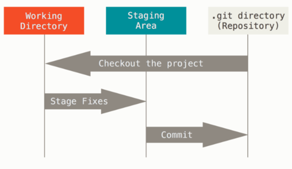
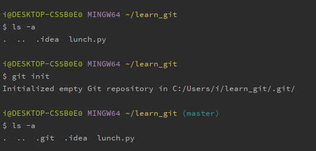
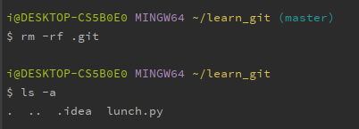
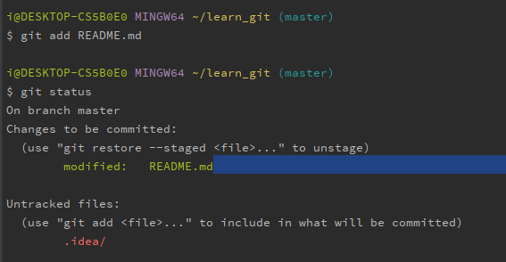
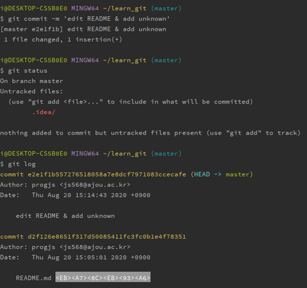
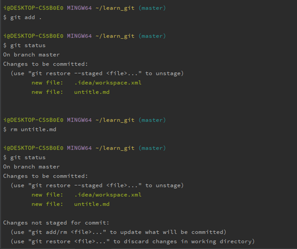
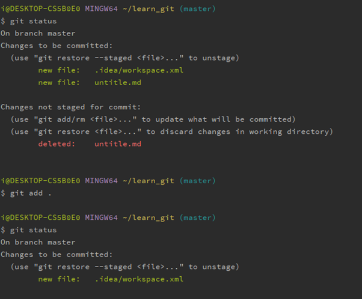
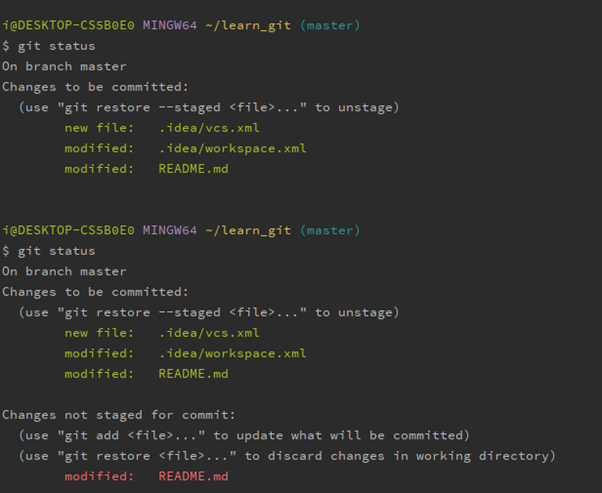

#### 인터페이스란?

> 서로 다른 시스템 간의 접점
>
> ex) HDMI

##### OpenSource

> 기술 생산  |   기술 활용
>
> * 기술 이해만 있다면 누구든 활용 가능

#### API

> application programming interface
>
> 소프트웨어 간의 커뮤니케이션 접점
>
> (endpoint만 공개되어있어, 그 시스템을 사용 가능한)
>
> - 웹 API : 해당 서버와 다른 서버가 통신하는 방식
>
>   ex) url 로 request(요청)하면 응답(response)한다
>
>   client <-> server(서빙같은 느낌)

##### MOOC

* [Edx - CS50][https://courses.edx.org/courses/course-v1:HarvardX+CS50+X/course/] : 컴퓨터 사이언스 개개론

- [UDACITY][https://www.udacity.com/] : (adit 청강가능)

* [Coursera][https://www.coursera.org/]

##### 필요한 공부들

- 언어

- 자료구조 + 알고리즘

- 컴퓨터 자체에 대한 이해(아키텍처 os)

- Domain knowledge

#### git bash 명령어

```
$ pwd
$ ls
$ mkdir learn_git
$ touch lunch.py
$ git
```

cmd에서도 git을 쓸 수 있다.


### Pycharm에서 git > bash.exe 로 terminal 설정

```
$ pip freeze
사용된 모듈들
$ pip freeze > requirements.txt
텍스트 파일에 모듈 이름들을 저장
$ mv packages requirements.txt
packages 파일의 내용들을 requirements.txt로 옮긴다(저장)
```

### 가상환경 생성

```
$ python -m venv venv
$ source venv/Scripts/activate
가상환경 실행

$ pip list
이 환경에서 설치된 패키지들만 보인다.
```

#### Git : 버전관리

> semantic: 의미를 담고 있는
>
> 버전에 의미를 담자 -> semver
>
> ex) 1.2.2(테마변경) -> 괄호 안이 commit message



```
$ git config --global user.name
$ git config --global user.email
```

이 repository에서만 username을 따로 설정해주고 싶을 때

```
$ git config --local user.name 새이름
```




#### Git 지우고 싶을 때

> 위에서 생긴 .git 폴더를 삭제한다.
>
> .git 있는 dir부터 하위 모든 폴더와 파일의 **git 버전관리** 가능




> [Markdown editor][https://www.typora.io]

### Git 결과와 명령어들의 의미

```
$ git status
Untracked file: 존재를 알고 있지만 모른척 했던 파일들

$ git add README.md
tracking 시장한 파일은 어느 부분이 update되었는지 알고 있다(추적중)

$ git restore --staged
이전 add로 돌아가기
```



> 초록색 글자의 파일들만 commit된다 (add 완료된 파일들)
>
> 아래에서 log를 보면 2개의 commit이 보인다.



> untitle.md 파일을 생성하고 add 한 후에 다시 status를 보면 삭제한 사실을 저장한다.





> Pycharm에서 vcs - intel..에서 -git 하면 GUI로 git 버전관리가 가능하다
>
> 파일별로 변경된 코드를 비교하며 확인가능하다.



> Add 한 후에 add했던 파일을 수정하면 중복돼서 초록, 빨강으로 모두 나온다.

#### .idea/

> Pycharm 껐다가 켜면 창 띄워져있는 것까지 그대로 남아있다. 
>
> 이럴 땐 commit을 무시하도록 설정 가능하다.

```
$ touch .gitignore
이렇게 commit하지 않을 파일들을 적어 놓는 파일 생성
.gitignore 파일에 commit을 무시할 파일이나 dir 이름을 저장한다.
```

간편하게 모두 찾아볼 수 있는 사이트: [git-scm][https://git-scm.com/book/ko/v2]


> Git: snapshot 찍어놓는것
>
> Github: 구글 드라이브 같은 것
>
> ​      \+ 장점: 공유하기 쉽다. (공동작업, 백업, SNS)

### Git repository 

```
$ Git repository 만들 때 readme와 .gitignore 모두 안만드는게 좋아
나중에 직접 만드는게 편하다.
Repo 이름도 local과 달라도 된다

$git remote add origin https://github.com/progjs/learn_git.git
repo 저장소와 local 저장소를 연결

$ git push -u origin master
-u : upstream 그냥 덮어서 올리겠다?
만약 이전 사용자의 정보가 남아있다면? – 자격증명관리자 - git삭제하고 다시 push
```

> git으로 프로젝트 관리할 때
> 1.	Touch .gitignore
> https://www.toptal.com/developers/gitignore 이거로 commit 무시할 파일들을 넣는다.
> 2.	Git init해준다

## Git 으로 Django 프로젝트 관리하기 위한 초기화

그냥 DJANGO_GIT 폴더를 root로 바로 만들어지게 하려면

```
$ django-admin startproject django_git .
```

Branch를 만들려면 첫번째 스냅샷인 commit을 해야한다.

```
$ git commit
```

뒤에 commit message를 안쓰고 commit하면 

vim화면으로 넘어가기 때문에 :q! 로 창을 나가고 다시 commit

 ```
$ git commit -ㅡ 'init django'

$ touch README.md
 ```

pycharm에서 interpreter랑 django의 structure도 잘 봐야 함.

```
$ pip install Django_extentions
개발할 때 짱편
```

```
패키지 새로 깔때마다
$ pip freeze > requirements.txt
```


## Git으로 DJango 프로젝트 버전 관리 하는 방법


```python
i@DESKTOP-CS5B0E0 MINGW64 ~/DJANGO_GIT
$ git init
Initialized empty Git repository in C:/Users/i/DJANGO_GIT/.git/

i@DESKTOP-CS5B0E0 MINGW64 ~/DJANGO_GIT (master)
$ git status
On branch master

No commits yet

Untracked files:
  (use "git add <file>..." to include in what will be committed)
        .gitignore
        django_git/
        manage.py

nothing added to commit but untracked files present (use "git add" to track)

i@DESKTOP-CS5B0E0 MINGW64 ~/DJANGO_GIT (master)
$ git add .

i@DESKTOP-CS5B0E0 MINGW64 ~/DJANGO_GIT (master)
$ git status
On branch master

No commits yet

Changes to be committed:
  (use "git rm --cached <file>..." to unstage)
        new file:   .gitignore
        new file:   django_git/__init__.py
        new file:   django_git/asgi.py
        new file:   django_git/settings.py
        new file:   django_git/urls.py
        new file:   django_git/wsgi.py
        new file:   manage.py


i@DESKTOP-CS5B0E0 MINGW64 ~/DJANGO_GIT (master)
$ git commit -m 'init project'
[master (root-commit) f154cf1] init project
 7 files changed, 529 insertions(+)
 create mode 100644 .gitignore
 create mode 100644 django_git/__init__.py
 create mode 100644 django_git/asgi.py
 create mode 100644 django_git/settings.py
 create mode 100644 django_git/urls.py
 create mode 100644 django_git/wsgi.py
 create mode 100644 manage.py

i@DESKTOP-CS5B0E0 MINGW64 ~/DJANGO_GIT (master)
$ git status
On branch master
nothing to commit, working tree clean

i@DESKTOP-CS5B0E0 MINGW64 ~/DJANGO_GIT (master)
$ 
```

#### git remote하기 위해 repository 만들기

```python
i@DESKTOP-CS5B0E0 MINGW64 ~/DJANGO_GIT (master)
$ git remote add origin https://github.com/progjs/DJANGO_GIT.git

i@DESKTOP-CS5B0E0 MINGW64 ~/DJANGO_GIT (master)
$ git push origin master
Enumerating objects: 10, done.
Counting objects: 100% (10/10), done.
Delta compression using up to 8 threads
Compressing objects: 100% (9/9), done.
Writing objects: 100% (10/10), 5.04 KiB | 5.04 MiB/s, done.
Total 10 (delta 1), reused 0 (delta 0), pack-reused 0
remote: Resolving deltas: 100% (1/1), done.
To https://github.com/progjs/DJANGO_GIT.git
 * [new branch]      master -> master

i@DESKTOP-CS5B0E0 MINGW64 ~/DJANGO_GIT (master)
$
```

